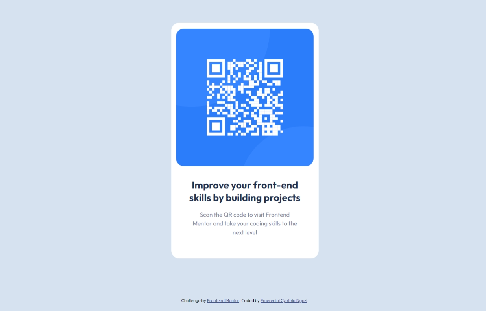

# Frontend Mentor - QR code component solution

This is a solution to the [QR code component challenge on Frontend Mentor](https://www.frontendmentor.io/challenges/qr-code-component-iux_sIO_H). Frontend Mentor challenges help you improve your coding skills by building realistic projects. 

## Table of contents

- [Overview](#overview)
  - [Screenshot](#screenshot)
  - [Links](#links)
- [My process](#my-process)
  - [Built with](#built-with)
  - [What I learned](#what-i-learned)
  - [Continued development](#continued-development)
- [Author](#author)

## Overview

### Screenshot




### Links

- Solution URL: [Github solution URL](https://github.com/cindyeme/frontend_mentor_challenges/tree/master/qr-code-component)
- Live Site URL: [Live site URL](https://your-live-site-url.com)

## My process

### Built with

- Semantic HTML5 markup
- CSS custom properties
- Flexbox
- Mobile-first workflow

### What I learned

I learned how to work with CSS Flexbox.
To make the code neater, I learned how to externally link my css file.

Some code snippets on how I got the experience:

```html
<link rel="stylesheet" href="style.css" />
```
```css
.wrapper {
  max-width: 375px;
  margin: 100px auto;
}

.content {
  padding: 20px;
  display: flex;
  flex-direction: column;
  justify-content: center;
  align-items: center;
  border-radius: 20px;
  padding: 15px 5px 25px 5px;
  background: #fff;
}
```

### Continued development

I would love to focus more on building with frameworks like React.js

## Author

- Website - [Emerenini Cynthia Ngozi](emereninicynthiangozi.herokuapp.com)
- Frontend Mentor - [@cindyeme](https://www.frontendmentor.io/profile/cindyeme)
- Twitter - [@CynthiaENgozi1](https://www.twitter.com/cynthiaengozi1)
